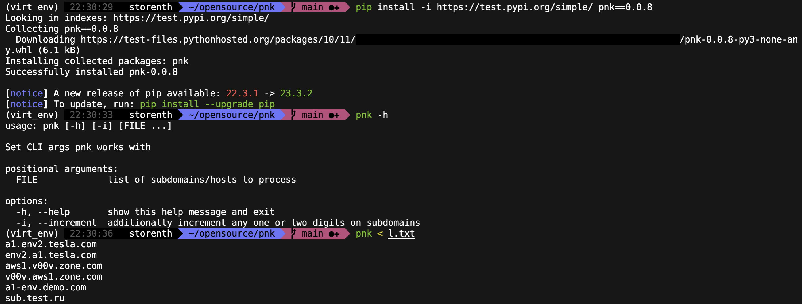

# pnk
Produce a combination of subdomains without repetitions - generates permutations P(n,k)

# Make it work
- [x] swap subs themselves: web.test.domain.com -> test.web.domain.com
- [x] increase/decrease subs with numbers: test1.domain.com -> test2.domain.com

# Make it right
1. `stdin`: reads standard input. This is useful for capturing a pipeline’s contents at an intermediate stage of processing.
2. `stdout`: supports standard output.
3. Works with the next arguments:
```
usage: pnk.py [-h] [-i] [-w WORDLIST] [FILE ...]

Set CLI args pnk works with

positional arguments:
  FILE                  list of subdomains/hosts to process

optional arguments:
  -h, --help            show this help message and exit
  -i, --increment       additionally increment digits on subdomains
```
```bash
$ cat subs1.txt subs2.txt | ./pnk.py
```

# Make it fast
WIP: but for now, to turn this single process script into multiprocess use [interlace](https://github.com/codingo/Interlace)


## Examples
Permutations:
```bash
echo "aws3.s11.env2.tesla.com" | ./src/pnk.py
aws3.s11.env2.tesla.com
aws3.env2.s11.tesla.com
s11.aws3.env2.tesla.com
s11.env2.aws3.tesla.com
env2.aws3.s11.tesla.com
env2.s11.aws3.tesla.com
```
With incrementation option
```bash
echo "aws3.s11.env2.tesla.com" | ./src/pnk.py -i
aws0.s11.env2.tesla.com
aws1.s11.env2.tesla.com
aws2.s11.env2.tesla.com
aws3.s11.env2.tesla.com
aws4.s11.env2.tesla.com
aws5.s11.env2.tesla.com
aws6.s11.env2.tesla.com
aws7.s11.env2.tesla.com
aws8.s11.env2.tesla.com
aws9.s11.env2.tesla.com
aws3.s00.env2.tesla.com
aws3.s01.env2.tesla.com
aws3.s02.env2.tesla.com
aws3.s03.env2.tesla.com
...
```

## Constraints
### Feature request
See the open [issue](https://github.com/storenth/pnk/issues/1#issue-2080221058) for the following feature requests:
- [ ] replace each subs with word in wordlist: v2.test.domain.com -> demo.test.domain.com
- [ ] prepend/append word by creating new subs: test.domain.com -> demo.test.domain.com, test.demo.domain.com
### Limitations
Unexpectedly works with incremet option in the following cases: more then two digits:
```
v123.tesla.com -> v123.tesla.com
aws.777v.amazon.com -> aws.777v.amazon.com
```
## TODO
1. Combinations of incrementations (cartesian product): 
```
5io5.33.ya.ru -> 0io0.00.ya.ru .. 9io9.99.ya.ru
```
2. Package
PyPi-test ready

